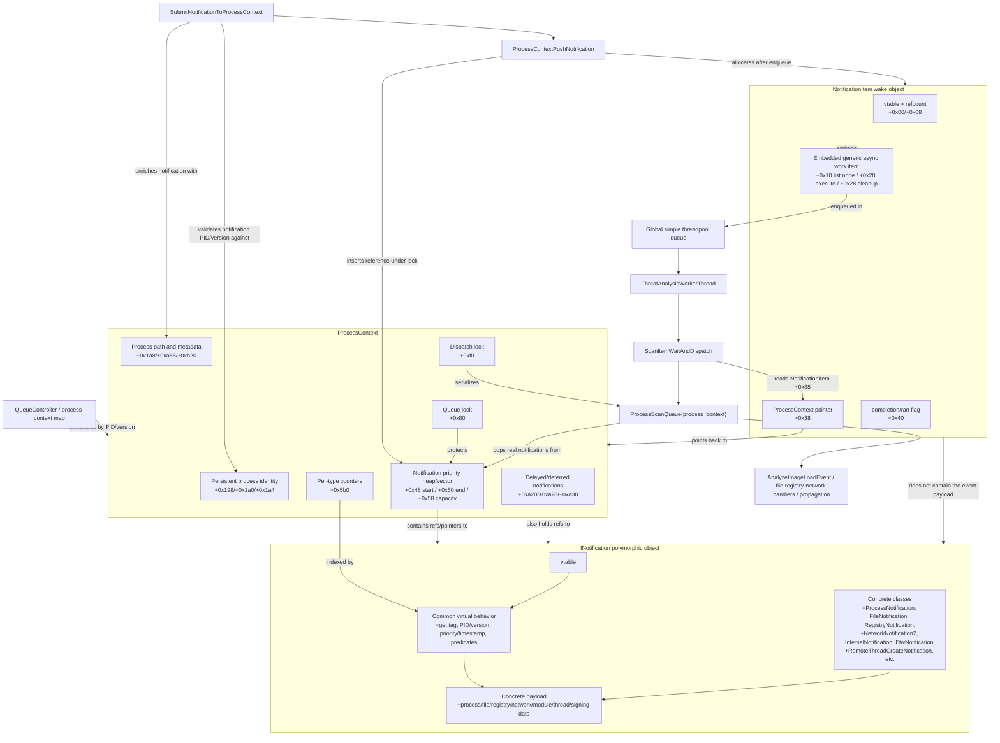

# Defender Data Structures

## Behavior Monitoring Process Context

The "process context" referenced by `defender-queues.md` is an internal Defender Behavior Monitoring object, not a Windows kernel `EPROCESS`, PEB, thread context, or CPU context.

Evidence in the binary points to an internal C++ class named `ProcessContext`:

| Evidence | Example |
|---|---|
| RTTI/class name | `.?AVProcessContext@@` |
| Diagnostic strings | `ProcessContext::SubmitNotification`, `ProcessContext::SetupProcessContexts - queue stopped` |
| Telemetry/config strings | `BmProcessContextSize`, `BmProcessContextStart`, `BmProcessContextStop`, `BmProcessContextInMemCount` |
| Queue integration | `CreateNotificationWorkItemForProcessContext`, `ProcessContextPushNotification`, `SubmitNotificationToProcessContext` |

Conceptually, this object is Defender's per-process BM tracking state. It is keyed by a persistent process identity tuple rather than just a PID, owns the per-process notification queue, stores process path/state metadata, and carries related-process/propagation state.

## Data Structure Relationship Diagram



The important distinction is that `NotificationItem` is not the notification. It is a wake object submitted to the global threadpool. The real event payload is an `INotification` object stored in the `ProcessContext` heap/vector.

## Relationship Summary

| Structure | Owns / contains | Points to | Main role |
|---|---|---|---|
| `ProcessContext` | Per-process notification heap, deferred lists, process identity/path state, counters, locks. | Notification objects in its heap/vector. | Long-lived per-process BM state and queue owner. |
| `INotification` | Polymorphic event payload and vtable-dispatched behavior. | Process identity tuple and type-specific event data. | Real scan/behavior event consumed by `ProcessScanQueue`. |
| `NotificationItem` | Embedded generic async work item. | `ProcessContext` at `+0x38`. | Short-lived threadpool wake wrapper used to drain a process context. |
| Generic async work item | Intrusive list links and execute/cleanup callbacks. | Callback `ScanItemWaitAndDispatch`. | Object actually inserted into the global simple threadpool queue. |

## `INotification` Object

`INotification` is the polymorphic base/interface for the real BM queue entries. `ProcessContextPushNotification` stores references to these objects in the per-process heap at `ProcessContext +0x48/+0x50/+0x58`; `ProcessScanQueue` later pops them and dispatches by their virtual methods and concrete type.

Evidence in the binary:

| Evidence | Example |
|---|---|
| RTTI/interface name | `.?AUINotification@@` |
| Concrete class RTTI | `ProcessNotification`, `FileNotification`, `RegistryNotification`, `NetworkNotification2`, `InternalNotification`, `EtwNotification`, `RemoteThreadCreateNotification`, `DesktopNotification` |
| Queue usage | `ProcessContextPushNotification`, `ProcessScanQueue`, `SubmitNotificationToProcessContext` |
| Type-name mapper | `GetNotificationTagName` maps notification tags `0x00` through `0x2e`. |

### Common Interface Behavior

Exact vtable slot names are inferred from call sites, but these behaviors are repeatedly used:

| Behavior | Used by | Meaning |
|---|---|---|
| Get notification tag/type | `QueueBmNotification`, `ProcessContextPushNotification`, `ProcessScanQueue`, report/log paths | Returns the top-level notification tag such as `ModuleLoad`, `FileCreate`, `RemoteThreadCreate`, etc. |
| Get persistent process identity | `SubmitNotificationToProcessContext` | Returns a PID/version or PID/creation-time tuple used to find the owning `ProcessContext`. |
| Attach process path/context metadata | `SubmitNotificationToProcessContext` | Enriches the notification after the matching process context is found. |
| Get priority/timestamp | `ProcessContextPushNotification` heap insertion | Orders the per-process priority heap. |
| Set or normalize queue timestamp | `ProcessContextPushNotification` | Keeps monotonic queue ordering when a notification lacks its own timestamp. |
| Exclusion/skippable predicates | `ProcessContextPushNotification`, `ProcessScanQueue` | Decides whether to drop, delay, propagate, or process a notification. |
| Type-specific accessors | Dispatch handlers | Return paths, registry keys, network fields, ASR data, signing fields, remote-thread fields, etc. |

### Observed Common Layout Pattern

The exact concrete object sizes vary by notification class. The following fields are observed across multiple concrete notification objects or strong use sites:

| Offset | Field / Meaning |
|---:|---|
| `+0x00` | Vtable pointer. |
| `+0x08` | Likely refcount / inherited reference-object state. Many notification objects are passed and released as refcounted objects. |
| `+0x10` | Notification tag in several concrete classes. For example `FileNotification` and `InternalNotification` handlers read `*(int *)(obj + 0x10)`. |
| `+0x18` range | Common identity/header fields returned by virtual accessors; includes the process identity tuple used for context lookup. Exact packing varies by class. |
| `+0xb0` range | Common state/predicate fields used by queue admission and timestamp logic. Exact meaning depends on subclass. |
| `+0xc8` and later | Concrete payload area for many notification classes. File paths, remote-thread target data, extended file metadata, signing fields, and internal subtypes appear here. |

String fields often use an inline/heap small-string layout: the field address is used directly for short strings, but a pointer inside the field is used when the stored capacity exceeds the inline threshold.

### Notification Tags

These are the top-level `INotification` tags mapped by `GetNotificationTagName`:

| Tag | Name | Main payload category |
|---:|---|---|
| `0x00` | `UndefinedNotificationTag` | Placeholder / invalid tag. |
| `0x01` | `ProcessStart` | Process identity, startup image/path metadata. |
| `0x02` | `ProcessTerminate` | Process identity, termination/deferred cleanup state. |
| `0x03` | `ProcessCreate` | Creator/child process identity and image/command metadata. |
| `0x04` | `DriverLoad` | Driver image path and load metadata. |
| `0x05` | `ModuleLoad` | Module/image path, trust/signing/ASR data; feeds the module dispatcher. |
| `0x06` | `OpenProcess` | Source/target process access metadata. |
| `0x07` | `FileCreate` | File path and create metadata. |
| `0x08` | `FileChange` | File path and change/write metadata. |
| `0x09` | `FileDelete` | File path and delete metadata. |
| `0x0a` | `FileRename` | Source path and destination path. |
| `0x0b` | `FileOpen` | File path and open metadata. |
| `0x0c` | `FolderCreate` | Folder path. |
| `0x0d` | `FolderRename` | Source folder path and destination folder path. |
| `0x0e` | `FolderEnum` | Folder enumeration path. |
| `0x0f` | `FileHardLink` | File path and hardlink target path. |
| `0x10` | `FileCreateEx` | Extended create metadata such as file state, user/domain/remote IP, size. |
| `0x11` | `FileChangeEx` | Extended write metadata such as offsets, write/append totals, write count, user/domain/remote IP. |
| `0x12` | `RegistryKeyCreate` | Registry key path. |
| `0x13` | `RegistryKeyRename` | Source and destination registry key path. |
| `0x14` | `RegistryKeyDelete` | Registry key path. |
| `0x15` | `RegistryValueSet` | Registry key, value name, data/type. |
| `0x16` | `RegistryValueDelete` | Registry key and value name. |
| `0x17` | `RegistryBlockSet` | Blocked registry set action metadata. |
| `0x18` | `RegistryBlockDelete` | Blocked registry delete action metadata. |
| `0x19` | `RegistryBlockRename` | Blocked registry rename action metadata. |
| `0x1a` | `RegistryBlockCreate` | Blocked registry create action metadata. |
| `0x1b` | `RegistryReplace` | Registry replace metadata. |
| `0x1c` | `RegistryRestore` | Registry restore metadata. |
| `0x1d` | `RegistryBlockReplace` | Blocked registry replace action metadata. |
| `0x1e` | `RegistryBlockRestore` | Blocked registry restore action metadata. |
| `0x1f` | `NetworkDetection` | Network endpoint/detection metadata. |
| `0x20` | `BootRecordChange` | Boot-record / boot-sector change metadata. |
| `0x21` | `RemoteThreadCreate` | Target process/thread identity and target image name. |
| `0x22` | `VolumeMount` | Device/volume mount metadata. |
| `0x23` | `DesktopMount` | Desktop/device mount metadata. |
| `0x24` | `ArDetectionTag` | Automatic-remediation / detection tag data. |
| `0x25` | `EngineInternal` | Internal notification with subtype at `+0x160`. |
| `0x26` | `EtwEvent` | ETW event wrapper and decoded ETW data. |
| `0x27` | `FileDeleteEx` | Extended file delete metadata. |
| `0x28` | `FileSequentialRead` | Sequential-read file metadata. |
| `0x29` | `ProcessForkCount` | Process fork/count metadata. |
| `0x2a` | `MemoryMap` | Memory map region/process metadata. |
| `0x2b` | `MemoryProtect` | Memory protection change metadata. |
| `0x2c` | `ProcessControl` | Process policy/control action metadata. |
| `0x2d` | `ProcessSignerDetailsMacOS` | Signer, cdhash, team ID, code-signing flags, verdict. |
| `0x2e` | `DbChanged` | Database-change notification. |

### Notable Concrete Payloads

| Concrete object / tag | Observed fields |
|---|---|
| `FileNotification` tags `0x07`, `0x08`, `0x09`, `0x0b`, `0x0c`, `0x0e`, `0x28`, `0x2e` | Primary path around `+0xd0`; type at `+0x10`; event-specific reporting IDs are selected by `ClassifyFileBehaviorNotification`. |
| `FileRename` / `FolderRename` tags `0x0a`, `0x0d` | Primary path around `+0xd0`; destination path accessor `GetFileRenameTargetPathField` returns field around `+0xf0`. |
| `FileHardLink` tag `0x0f` | Primary path around `+0xd0`; hardlink target accessor `GetFileHardLinkTargetPathField` returns field around `+0x110`. |
| `FileCreateEx` / `FileChangeEx` / `FileDeleteEx` tags `0x10`, `0x11`, `0x27` | Extended metadata copied by `CopyExtendedFileNotificationInfo`: multiple string fields, file state, offset/size counters, user/domain/remote IP style fields. |
| `ModuleLoad` tag `0x05` | Module path/image path, path aliases, trust/friendly cache inputs, ASR rule data, signing fields. Later module-subtype dispatch handles cases `1`, `2`, `3`, `4`, `5`, `6`, `0x29`, `0x2d`. |
| `RemoteThreadCreate` tag `0x21` | Target process creation time at about `+0xc8`, target process ID at `+0xd0`, target thread creation time at about `+0xd4`, target thread ID at `+0xdc`, target image name pointer/string at `+0xe0`. |
| `EngineInternal` tag `0x25` | Internal subtype at `+0x160`; subtype `0x10` can use the alternate process queue limit, and subtype `0x23` is recognized by `IsInternalNotificationSubtype23`. |
| `ProcessSignerDetailsMacOS` tag `0x2d` / module signing case | Path plus signer, cdhash, team ID, verdict, and code-signing flags. |

## `NotificationItem` Wake Object

`NotificationItem` is not an `INotification`. It is the object created by `CreateNotificationWorkItemForProcessContext` so a global threadpool worker wakes up and drains one process context.

Observed layout:

| Offset | Field / Meaning |
|---:|---|
| `+0x00` | `NotificationItem` vtable. |
| `+0x08` | Refcount. |
| `+0x10` | Embedded generic async work item / intrusive list node. This address is submitted to the global simple threadpool. |
| `+0x18` | Embedded async item list/state field. |
| `+0x20` | Async execute callback. For this flow, it runs `ScanItemWaitAndDispatch`. |
| `+0x28` | Async cleanup/release callback. |
| `+0x30` | Async item state initialized by the work-item setup helper. |
| `+0x38` | Pointer back to the owning `ProcessContext`. `ScanItemWaitAndDispatch` uses this pointer to call `ProcessScanQueue`. |
| `+0x40` | Completion/ran flag set after processing. |

Operationally, the path is:

```text
ProcessContextPushNotification
  -> enqueue INotification into ProcessContext heap
  -> CreateNotificationWorkItemForProcessContext
  -> NotificationItem +0x38 = process_context
  -> SubmitAsyncWorkItemToGlobalPool(NotificationItem +0x10)
  -> ScanItemWaitAndDispatch
  -> ProcessScanQueue(process_context)
```

## Process Context Layout

Observed fields:

| Offset | Field / Meaning |
|---:|---|
| `+0x00` | Likely vtable. |
| `+0x08` | Reference count. |
| `+0x28` | Queue/context stopped flag checked by `ProcessContextPushNotification`. |
| `+0x48` | Notification heap/vector start. |
| `+0x50` | Notification heap/vector end. |
| `+0x58` | Notification heap/vector capacity. |
| `+0x74` | Normal queue size limit / threshold. |
| `+0x78` | Alternate queue size limit / threshold used for some internal notifications. |
| `+0x80` | Queue lock protecting the notification heap/vector. |
| `+0xb0` | Last enqueue/activity timestamp updated on push. |
| `+0xb8` | Synchronization object used by `ScanItemWaitAndDispatch`. |
| `+0xf0` | Dispatch lock used by `ProcessScanQueue`. |
| `+0x188` | Termination/event timestamp state. |
| `+0x194` | Exclusion/cache flag. |
| `+0x198` | Persistent process identity, first field. Used for context lookup and validation. |
| `+0x1a0` | Persistent process identity/status field. Used with `+0x198`. |
| `+0x1a4` | Additional identity/status field copied into module-event snapshots. |
| `+0x1a8` | Primary image path string storage. |
| `+0x1c8` | Path/startup/module metadata copied by `SnapshotProcessContextForModuleEvent`. |
| `+0x1e0` | Additional path/startup/module metadata copied by `SnapshotProcessContextForModuleEvent`. |
| `+0x260` | Process metadata field copied into module-event snapshots and compared during startup notification handling. |
| `+0x264` | Process metadata flag copied into module-event snapshots. |
| `+0x508` | Related-process / propagation list root. |
| `+0x510` | Related-process / propagation state pointer. |
| `+0x580` | Lock for related-process / propagation state. |
| `+0x5b0` | Per-notification-type counters. Indexed by notification type. |
| `+0x728` | Total enqueue/activity counter. |
| `+0xa18` | Process-context state flags. Bit `0x10` means initialization completed for normal processing. |
| `+0xa20` | Delayed startup/type-1 notification. |
| `+0xa28` | Delayed termination/type-2 notification. |
| `+0xa30` | Deferred notification vector/list storage. |
| `+0xa38` | Deferred notification vector/list end. |
| `+0xa40` | Deferred notification vector/list capacity. |
| `+0xa58` | Normalized/current process image path pointer. |
| `+0xa60` range | Process-state flags used for startup, termination, initialization, and propagation handling. |
| `+0xa6a` | Startup/type-1 notification observed flag. |
| `+0xa6b` | Termination/deferred state flag. |
| `+0xa6c` | Process state flag updated when notifications indicate special/internal status. |
| `+0xa70` | Timestamp used for startup/termination timing logic. |
| `+0xa78` | Lock protecting process path and process metadata fields. |
| `+0xb20` | Pointer to a process metadata/provider object. |
| `+0xb28` | Flags, including exclusion-related state. |

The exact names are inferred from use sites; several fields are still typed only by behavior.

## Role In Queue Flow

The process context owns the real per-process notification queue. The global threadpool work item is only a wake-up wrapper.

Queue relationship:

```text
Notification object
  -> ProcessContextPushNotification(process_context, ...)
  -> inserted into process_context +0x48/+0x50/+0x58 priority heap
  -> CreateNotificationWorkItemForProcessContext(process_context)
  -> NotificationItem +0x38 points back to process_context
  -> global threadpool executes ScanItemWaitAndDispatch
  -> ProcessScanQueue(process_context)
  -> pops and dispatches notifications from the process-context heap
```

`CreateNotificationWorkItemForProcessContext` allocates a `NotificationItem` and stores the process-context pointer at `NotificationItem +0x38`. It also increments the process context's reference count. The work item itself does not carry the module/process event payload.

## Main Contents By Category

| Category | Contents |
|---|---|
| Identity | Persistent PID/start/version tuple at `+0x198/+0x1a0/+0x1a4`. |
| Paths | Primary image path at `+0x1a8`, normalized/current image path at `+0xa58`. |
| Queue state | Notification heap/vector at `+0x48/+0x50/+0x58`, size limits at `+0x74/+0x78`, queue lock at `+0x80`. |
| Dispatch state | Dispatch lock at `+0xf0`, initialization flag at `+0xa18`, deferred notifications at `+0xa20/+0xa28/+0xa30`. |
| Exclusion state | Exclusion/cache flag at `+0x194`, additional flags at `+0xb28`. |
| Propagation state | Related-process list/state around `+0x508/+0x510`, protected by `+0x580`. |
| Counters/telemetry | Per-type counters at `+0x5b0`, total enqueue/activity counter at `+0x728`, timestamps at `+0xb0/+0x188/+0xa70`. |
| External helpers | Process metadata/provider pointer at `+0xb20`, synchronization object at `+0xb8`. |

## Lookup And Routing

`SubmitNotificationToProcessContext` and `LookupTrackedProcessContextByPidVersion` locate this object using the notification's PID/version tuple. The code validates that the notification tuple matches the context identity at `+0x198` before enqueueing.

If a suitable context is found, `SubmitNotificationToProcessContext` enriches the notification with process path/identity metadata and calls `ProcessContextPushNotification`. If not, the notification can be dropped/logged or used by surrounding setup code to create/update tracking state.