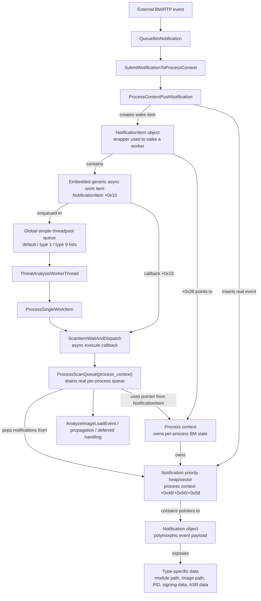

# Defender Queue And Work-Item Flow

The execution chain has two queue layers:

1. Global simple threadpool queue
2. Per-process Behavior Monitoring notification queue

The worker-thread frames process the global threadpool queue. The actual module/process scan notifications are stored in the per-process Behavior Monitoring queue and are drained later by `ProcessScanQueue`.


## Relationship Diagram



Important relationship: the global threadpool work item is only a wake-up wrapper. The real events live in the process context's per-process notification heap, and `ProcessScanQueue` drains that heap after the worker runs `ScanItemWaitAndDispatch`.


## data structure: polymorphic notification object

There are two “type” layers:

| Layer | Meaning |
|---|---|
| Notification tag | The top-level `INotification` type. This is the full enum returned by the type-name mapper. |
| Module scan subtype | Some `ModuleLoad` / image notifications are later dispatched by `ClassifyImageModuleEvent` into cases like `1`, `3`, `5`, `6`, `0x29`, `0x2d`. |

Common data on notifications:

| Common data | Purpose |
|---|---|
| Type/tag | Selects handler. |
| PID/version tuple | Finds the owning process context. |
| Queue priority/timestamp | Used by the per-process heap. |
| Filtering flags/predicates | Decide drop, delay, propagate, or process. |
| Type-specific payload | Path, registry key, network tuple, module info, etc. |

**Top-Level Notification Tags**

| Type | Name | Data Carried |
|---:|---|---|
| `0x00` | `UndefinedNotificationTag` | Invalid/unknown placeholder. |
| `0x01` | `ProcessStart` | Process PID/version, image path, parent/process metadata, startup snapshot data. |
| `0x02` | `ProcessTerminate` | PID/version, termination state, cleanup/deferred process-state data. |
| `0x03` | `ProcessCreate` | Creator/child process IDs, image path, command-line/process metadata. |
| `0x04` | `DriverLoad` | Driver/module image path and load metadata. |
| `0x05` | `ModuleLoad` | Module path/image path, module identity, signing/trust/ASR-related fields. This feeds the module dispatcher. |
| `0x06` | `OpenProcess` | Source process, target process, requested access/control flags. |
| `0x07` | `FileCreate` | File path, file metadata, optional normalized path. |
| `0x08` | `FileChange` | File path, change metadata, file-state info. |
| `0x09` | `FileDelete` | File path and delete metadata. |
| `0x0a` | `FileRename` | Source path plus destination path. |
| `0x0b` | `FileOpen` | File path and open metadata. |
| `0x0c` | `FolderCreate` | Folder path. |
| `0x0d` | `FolderRename` | Source folder path plus destination folder path. |
| `0x0e` | `FolderEnum` | Folder path/enumeration target. |
| `0x0f` | `FileHardLink` | Main file path plus hardlink/alternate path. |
| `0x10` | `FileCreateEx` | Extended create data: file path, user/domain/remote IP, file size, file-state fields. |
| `0x11` | `FileChangeEx` | Extended write/change data: offsets, total write/append size, write count, user/domain/remote IP. |
| `0x12` | `RegistryKeyCreate` | Registry hive/root, key path. |
| `0x13` | `RegistryKeyRename` | Registry source key and destination/new key. |
| `0x14` | `RegistryKeyDelete` | Registry hive/root and key path. |
| `0x15` | `RegistryValueSet` | Registry key, value name, value data/type. |
| `0x16` | `RegistryValueDelete` | Registry key and value name. |
| `0x17` | `RegistryBlockSet` | Blocked registry value-set operation plus policy/action metadata. |
| `0x18` | `RegistryBlockDelete` | Blocked registry delete operation plus policy/action metadata. |
| `0x19` | `RegistryBlockRename` | Blocked registry rename operation plus policy/action metadata. |
| `0x1a` | `RegistryBlockCreate` | Blocked registry create operation plus policy/action metadata. |
| `0x1b` | `RegistryReplace` | Registry replace/restore source-target data. |
| `0x1c` | `RegistryRestore` | Registry restore data. |
| `0x1d` | `RegistryBlockReplace` | Blocked registry replace operation plus policy/action metadata. |
| `0x1e` | `RegistryBlockRestore` | Blocked registry restore operation plus policy/action metadata. |
| `0x1f` | `NetworkDetection` | Network metadata: endpoint/connection info, detection/behavior data. Special-cased by `AnalyzeImageLoadEvent`. |
| `0x20` | `BootRecordChange` | Boot-record/boot-sector change data, likely including encoded boot-sector payload. |
| `0x21` | `RemoteThreadCreate` | Source/target PID, target/called/return addresses, stack address, return-address module path. |
| `0x22` | `VolumeMount` | Device name, volume/mount metadata, hot-pluggable state. |
| `0x23` | `DesktopMount` | Desktop/mount-style device context. |
| `0x24` | `ArDetectionTag` | Automatic remediation / detection tag data. |
| `0x25` | `EngineInternal` | Internal notification payload. Has an internal subtype at roughly `+0x160`; used for engine/BM control events. |
| `0x26` | `EtwEvent` | ETW-derived event info: provider/event identity plus decoded data items. |
| `0x27` | `FileDeleteEx` | Extended delete data: file path, user/domain/remote IP, file size. |
| `0x28` | `FileSequentialRead` | File path plus sequential-read metadata. |
| `0x29` | `ProcessForkCount` | Process fork/count metadata. Also used in module reporting as event `0x409e` with extra flags/count at the later payload area. |
| `0x2a` | `MemoryMap` | Target process, base address/region, allocation/protection flags. |
| `0x2b` | `MemoryProtect` | Target process, base address/region, old/current/new protection flags. |
| `0x2c` | `ProcessControl` | Process policy/control action, target PID, action/reason/rule data. |
| `0x2d` | `ProcessSignerDetailsMacOS` | Image path, signer, cdhash, team ID, code-signing flags, verdict. |
| `0x2e` | `DbChanged` | Database-change notification; exact payload not fully reconstructed, but it is routed through file-style reporting as event `0x40af`. |

**Module Dispatcher Cases**

These are the cases handled by `ClassifyImageModuleEvent` after the notification reaches the module/image pipeline:

| Case | Meaning | Data Used |
|---:|---|---|
| `1` | Initial process/module load snapshot | Process snapshot, image path, normalized/alternate path, hardlink aliases. |
| `2` | Termination/deferred cleanup | Process context cleanup state, deferred path/process state. |
| `3` | Module path event | Module path, normalized path, alternate names, PID/version tuple. |
| `4` | Cleanup-only path | Mostly process context; no rich notification payload used. |
| `5` | Trust/friendly/cache evaluation | Module path, previous process image path, normalized path, exclusion result, friendly-cache/slow-check result. |
| `6` | Running module / ASR path | Module identity/path, ASR rule data, command line, process integrity, target path, rule/action state. |
| `0x29` | Signing/trust-style report | Path plus extra signing/trust flags/count field. Emits event `0x409e`. |
| `0x2d` | Code-signing verdict | Path, signer, cdhash, team ID, code-signing flags, verdict byte. Emits event `0x40a5`. |

The best-reconstructed concrete layouts are the module and file families. Registry, network, ETW, memory, and internal notifications are clearly named and routed, but I did not fully recover every field offset for those classes.


## Thread Creation Notification Type

Yes. It is there as **remote thread creation**, not generic “thread create”.

Key entries:

| Item | Meaning |
|---|---|
| Notification tag `0x21` | `RemoteThreadCreate` |
| Behavior event `0x400e` | `BM_RemoteThreadCreate` |
| Class RTTI | `RemoteThreadCreateNotification` |
| Related resource item | `RemoteThreadCreateResourceItem` |

The remote-thread notification carries at least:

| Field | Meaning |
|---|---|
| Source process PID/version | The process that owns the current notification context. |
| Target process ID | Process receiving the remote thread. |
| Target process creation time | Disambiguates PID reuse. |
| Target thread ID | The created remote thread. |
| Target thread creation time | Timestamp/identity for the thread. |
| Target image name | Image path of the target process. |
| Optional short target image name | Resolved via image-name resolver. |

I found a formatter that emits:

```text
<RemoteThreadCreate
  TargetProcessId="%u"
  TargetProcessCreationTime="%llu"
  TargetThreadId="%u"
  TargetThreadCreationTime="%llu"
  TargetImageName="%s">
```

There are also thread-manipulation/injection behavior events:

| Event ID | Name |
|---:|---|
| `0x401d` | `BM_Etw_SetThreadContext` |
| `0x4020` | `BM_Etw_OpenThread` |
| `0x4070` | `BM_Etw_SuspendThread` |
| `0x4071` | `BM_Etw_ResumeThread` |
| `0x402e` | `BM_Etw_CodeInjection` |
| `0x408a` | `BM_Etw_V2CodeInjection` |

One handler also turns a remote-thread event into code-injection reports with:

```text
injectiontype:remotethread;
```

So: there is no obvious generic `BM_CreateThread` event in this path, but there is explicit support for **remote thread creation** and related thread tampering/injection telemetry.


## Data structure: Process

Yes. In `defender-queues.md`, “process context” means an internal Defender Behavior Monitoring C++ object, not a Windows `EPROCESS`, PEB, thread context, or CPU context.

Evidence from the binary points to an internal class named `ProcessContext` (`.?AVProcessContext@@`, strings like `ProcessContext::SubmitNotification`, `BmProcessContextSize`, `BmProcessContextStart/Stop`). It is the per-process BM tracking object that owns the real notification queue.

Observed contents include:

| Offset | Meaning |
|---:|---|
| `+0x00` | likely vtable |
| `+0x08` | refcount |
| `+0x28` | queue/context stopped flag |
| `+0x48/+0x50/+0x58` | vector/heap of pending notification objects |
| `+0x74/+0x78` | queue size limits/thresholds |
| `+0x80` | queue lock |
| `+0xb8` | synchronization object used by `ScanItemWaitAndDispatch` |
| `+0xf0` | dispatch lock used by `ProcessScanQueue` |
| `+0x188` | termination/event timestamp state |
| `+0x194` | exclusion/cache flag |
| `+0x198/+0x1a0/+0x1a4` | persistent process identity tuple, likely PID plus creation/version data |
| `+0x1a8` | primary image path string storage |
| `+0x1c8/+0x1e0/...` | path/startup/module metadata copied into scan events |
| `+0x508/+0x510` | related-process / propagation linkage |
| `+0x580` | lock for related-process state |
| `+0x5b0` | per-notification-type counters |
| `+0x728` | total/enqueue counter |
| `+0xa18` | state flags; bit `0x10` means initialized/ready for normal processing |
| `+0xa20` | delayed startup/type-1 notification |
| `+0xa28` | delayed termination/type-2 notification |
| `+0xa30/+0xa38/+0xa40` | deferred notification vector/list |
| `+0xa58` | normalized/current process image path pointer |
| `+0xa60` range | process-state flags used for startup/termination/propagation behavior |
| `+0xa78` | lock for path/process metadata |
| `+0xb20` | pointer to process metadata/provider object |
| `+0xb28` | flags, including exclusion-related state |

Conceptually, it contains:

- Process identity: PID/start/version tuple, not just PID.
- Image path and normalized path state.
- Per-process BM notification priority queue.
- Deferred startup/termination/internal notifications.
- Locks and synchronization for queue draining.
- Exclusion and initialization flags.
- Related-process/propagation state.
- Counters and telemetry bookkeeping.
- Pointers to helper/provider/metastore-related objects.

The global threadpool `NotificationItem` does not contain the actual event. It stores a pointer to this `ProcessContext`; then `ScanItemWaitAndDispatch` calls `ProcessScanQueue(process_context)`, which pops the real notification objects from the context-owned heap.


# Analysis

## 1. Global Threadpool Work Item

Worker thread path:

```text
ThreatAnalysisWorkerThread
  -> DequeueNextSimpleThreadPoolWorkItem
  -> ProcessSingleWorkItem
  -> work_item->callback()
  -> work_item->release()
```

In this stack, the callback is:

```text
ScanItemWaitAndDispatch
  -> ProcessScanQueue
```

### Generic Work Item Layout

The item popped by `ThreatAnalysisWorkerThread` is a generic async work item.

| Offset | Field | Meaning |
|---:|---|---|
| `+0x00` | list link | Intrusive queue link. |
| `+0x08` | list link | Intrusive queue link. |
| `+0x10` | callback / execute function | Called by `ProcessSingleWorkItem`. For this chain, points to `ScanItemWaitAndDispatch`. |
| `+0x18` | release / cleanup function | Called after execution. |
| later fields | item-specific payload | For the BM notification item, includes process-context pointer. |

The work queue has three internal lists:

| Queue bucket | Selection |
|---|---|
| default list | Normal work items. |
| type `1` list | Special/priority bucket. |
| type `9` list | Another special bucket. |

The pop order in `DequeueNextSimpleThreadPoolWorkItem` is:

1. type `9` list
2. default list
3. type `1` list

### Threadpool Enqueue Function

The actual enqueue helper is:

```text
EnqueueSimpleThreadPoolWorkItem
```

What it does:

- Takes a work item.
- Inserts it into one of the three work lists.
- Increments queued-work count.
- If below max active worker count, wakes/submits worker execution.
- Worker later calls `ThreatAnalysisWorkerThread`.

Related threadpool helpers:

| Function | Purpose |
|---|---|
| `EnqueueSimpleThreadPoolWorkItem` | Pushes generic async work item into the simple threadpool. |
| `DequeueNextSimpleThreadPoolWorkItem` | Pops next work item from priority/default queues. |
| `ThreatAnalysisWorkerThread` | Worker-loop body. |
| `ProcessSingleWorkItem` | Calls the work item's execute callback and cleanup callback. |
| `ScanItemWaitAndDispatch` | Concrete work-item callback that drains the BM process queue. |
| `SubmitAsyncWorkItemToGlobalPool` | Wrapper used to submit the created notification work item to the global pool. |

## 2. BM Notification Work Item

The work item submitted to the global pool is created here:

```text
CreateNotificationWorkItemForProcessContext
```

This creates a `NotificationItem` object.

### `NotificationItem` Layout

| Offset | Field | Meaning |
|---:|---|---|
| `+0x00` | vtable | `NotificationItem::vftable`. |
| `+0x08` | refcount | Reference count. |
| `+0x10` | embedded async item / list node | Passed to the global async work pool. |
| `+0x18` | embedded async item / list node | Intrusive queue link / work-item state. |
| `+0x20` | execute callback | Set through the embedded async item setup. |
| `+0x28` | cleanup callback | Set through the embedded async item setup. |
| `+0x30` | async item state | Initialized by helper. |
| `+0x38` | process context pointer | Points to the BM per-process context. |
| `+0x40` | completion/ran flag | Set by `ScanItemWaitAndDispatch` after processing. |

Operationally:

```text
NotificationItem
  -> global work callback
  -> ScanItemWaitAndDispatch
  -> ProcessScanQueue(process_context)
```

The global threadpool item does not directly contain the module/process event. It contains a pointer to the process context, and that process context owns the real notification queue.

## 3. Per-Process BM Notification Queue

The real scan items are notifications stored in the process context.

The push function is:

```text
ProcessContextPushNotification
```

This is the key producer-side function.

### What The Per-Process Notification Contains

A notification is a polymorphic object. The exact concrete layout depends on the notification type, but `ProcessScanQueue` consistently uses these vtable slots:

| Vtable slot / behavior | Meaning |
|---|---|
| get notification type | Returns values like `1`, `2`, `3`, `5`, `6`, `0x29`, `0x2d`. |
| get PID/version tuple | Used to associate notification with the correct process context. |
| get priority/timestamp | Used for heap ordering in the process queue. |
| filtering predicates | Used to decide whether to drop, delay, propagate, or process. |
| type-specific fields | Module path, image path, signing data, ASR rule data, command line, target PID, etc. |

The queue itself is a priority heap/vector at the process context:

| Process context field | Meaning |
|---:|---|
| `+0x48` | heap/vector start for queued notifications. |
| `+0x50` | heap/vector end. |
| `+0x58` | heap/vector capacity. |
| `+0x74` / `+0x78` | queue limits / thresholds. |
| `+0x80` | queue lock. |
| `+0xf0` | dispatch lock used by `ProcessScanQueue`. |

`ProcessContextPushNotification` does these things:

- Checks whether the process context queue is stopped.
- Checks whether the process is excluded and whether the notification is skippable.
- Updates per-notification-type counters.
- Checks queue capacity.
- Inserts the notification into the priority heap.
- Creates a `NotificationItem` for the process context.
- Submits that `NotificationItem` to the global threadpool through `SubmitAsyncWorkItemToGlobalPool`.

## 4. Who Pushes Work Items Into The Queue

### Direct Producer

```text
ProcessContextPushNotification
```

Direct callers:

| Caller | Role |
|---|---|
| `SubmitNotificationToProcessContext` | Finds the correct process context for a notification, prepares path/process metadata, then pushes it. |
| `PropagateNotificationToRelatedProcesses` | Pushes a notification into related process contexts. |
| `BroadcastNotificationToActiveProcessContexts` | Broadcasts a notification to multiple active process contexts. |

### Queue Controller Layer

```text
QueueBmNotification
```

This is the main queue-controller entry point.

It does:

- Checks performance exclusion list.
- Calls notification factory to create one or more notification objects.
- Ensures process context exists.
- Calls `SubmitNotificationToProcessContext`.

Callers:

| Caller | Source category |
|---|---|
| `QueueRtpNotification` | Main RTP/BM notification queue path. |
| `QueueExtendedRtpNotification` | Alternate/extended notification input layout. |

### Upstream Notification Adapters

These are domain adapters that accept different notification domains and forward into the BM queue path.

| Function | Domain / category | Behavior |
|---|---:|---|
| `FUN_180122690` | domain `1` | Validates domain, then forwards to `QueueRtpNotification`. |
| `FUN_180123120` | domain `2` | Runs extra callbacks, then forwards to `QueueRtpNotification`. Likely process lifecycle / termination-related domain. |
| `FUN_1806163d0` | domain `8` | Validates domain, then forwards to `QueueRtpNotification`. |
| `FUN_1805eeab0` | domain `9` | Validates domain, then forwards to `QueueRtpNotification`. |
| `FUN_180a6c4a0` | extended input path | Uses metastore/controller, then calls `QueueExtendedRtpNotification`. |
| `HandlePropagationBehaviorReport` | propagation report path | Can call `BroadcastNotificationToActiveProcessContexts` for propagation-parent events. |

## 5. `ProcessScanQueue` Dispatch Subsystems

`ProcessScanQueue` drains the per-process notification queue and routes notifications into several subsystems.

### Dispatch Overview

| Notification condition | Destination subsystem |
|---|---|
| Type `1` | Startup/process/module-load tracking; can be delayed until process context is initialized. |
| Type `2` | Termination/deferred cleanup path; can be held separately and processed after earlier events. |
| Type `3`, `5`, `6`, `0x29`, `0x2d` | Main image/module behavior path via `AnalyzeImageLoadEvent`. |
| Type `0x2d` | Code-signing verdict path. |
| Predicate `FUN_180681050` true, type field `0x23` | Deferred list at process context `+0xa30`; processed after initialization. |
| Queue not initialized / `a18 & 0x10` not set | Initializes process state first, then replays delayed events. |
| Tainted or related-process state set | Can propagate notification to related process contexts. |

### Subsystems Reached From `ProcessScanQueue`

| Subsystem | Function path |
|---|---|
| Module/classification pipeline | `AnalyzeImageLoadEvent` -> `InvokeModuleScanCallbacks` -> `ClassifyImageModuleEvent`. |
| Related-process propagation | `PropagateNotificationToRelatedProcesses`. |
| Deferred process-state update | `UpdateDeferredProcessPathState`. |
| Process context initialization | `FUN_1801d9fd8` path, then delayed event replay. |
| Parent/propagation tracking | `ReportParentPropagationMatches`, `UpdateParentPropagationProcessId`. |
| Cleanup checks | `ProcessScanCleanupChecks` through the module classification path. |
| Hollowing / SeDebug / integrity checks | Reached later through `ProcessScanCleanupChecks`. |

## 6. Chronological Queue Flow

```text
External BM/RTP event arrives
  -> domain adapter validates event domain
  -> QueueRtpNotification / QueueExtendedRtpNotification
  -> QueueBmNotification
  -> SubmitNotificationToProcessContext
  -> ProcessContextPushNotification
       - inserts notification into per-process priority heap
       - creates NotificationItem for process context
       - submits NotificationItem to global simple threadpool
  -> EnqueueSimpleThreadPoolWorkItem
  -> ThreatAnalysisWorkerThread
  -> ProcessSingleWorkItem
  -> ScanItemWaitAndDispatch
  -> ProcessScanQueue
  -> AnalyzeImageLoadEvent / propagation / deferred handling
  -> ClassifyImageModuleEvent and cleanup checks
```

In short: notifications are pushed by `ProcessContextPushNotification`, usually through `QueueBmNotification` and `SubmitNotificationToProcessContext`; the worker thread only wakes up a process-context drain item, and `ProcessScanQueue` performs the real notification dispatch.
