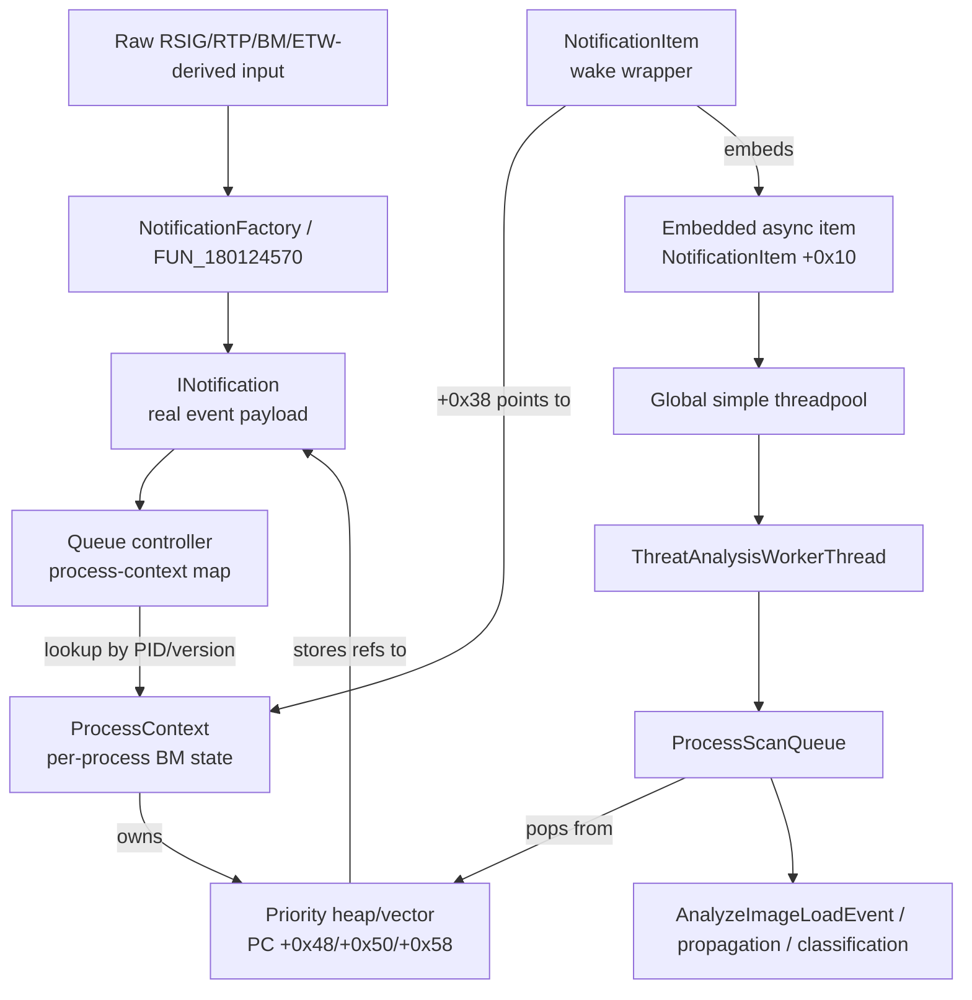

# Defender Behavior Monitoring High-Level Architecture

This document summarizes the observed Defender Behavior Monitoring (BM) queueing design from `defender-queues.md`, `defender-data-structures.md`, and `defender-queues-input.md`, with spot checks against Ghidra MCP.

The main architectural point is that Defender separates **event payloads** from **worker wake-ups**:

- The real event is an `INotification` object.
- The real event queue is owned by a per-process `ProcessContext`.
- The global threadpool receives a lightweight `NotificationItem` wake object.
- The wake object only points back to the `ProcessContext`; it does not contain the event payload.
- `ProcessScanQueue` drains the per-process queue and performs the meaningful dispatch.

## Executive Summary For Red Teamers

Defender does not appear to process every BM/RTP/ETW-derived event directly on the input callback. Incoming telemetry is converted into internal notification objects, associated with a tracked process identity, and queued into a per-process context. A generic global worker thread is only used to wake processing for that process context.

For reverse-engineering purposes, this creates four useful layers:

| Layer | What It Represents | Why It Matters |
|---|---|---|
| Input adapters | RSIG/RTP, extended RTP, and ETW-derived BM event boundaries. | Closest layer to external telemetry entering the BM pipeline. |
| Notification factory | Converts raw input into one or more internal `INotification` objects. | This is where raw event formats become Defender's internal event taxonomy. |
| Process context routing | Finds or creates the per-process `ProcessContext` and enriches the notification with process metadata. | This is where events become tied to a persistent process identity rather than only a PID. |
| Queue drain and dispatch | Worker wakes `ProcessScanQueue`, which pops notifications and routes them to module, process, propagation, cleanup, and behavior-analysis logic. | This is where correlations and higher-level behavior interpretation happen. |

If you are mapping detection behavior, the high-value control points are usually `QueueRtpNotification`, `QueueExtendedRtpNotification`, `NotificationFactory` / `FUN_180124570`, `QueueBmNotification`, `SubmitNotificationToProcessContext`, `ProcessContextPushNotification`, and `ProcessScanQueue`.

## End-To-End Flow

```text
External or upstream event
  -> RSIG/RTP or BM/ETW adapter
  -> QueueRtpNotification / QueueExtendedRtpNotification
  -> NotificationFactory / FUN_180124570
  -> QueueBmNotification
  -> SubmitNotificationToProcessContext
  -> ProcessContextPushNotification
       - inserts INotification into ProcessContext notification heap
       - creates NotificationItem wake object
       - submits embedded async item to global simple threadpool
  -> ThreatAnalysisWorkerThread
  -> ProcessSingleWorkItem
  -> ScanItemWaitAndDispatch
  -> ProcessScanQueue(ProcessContext)
  -> AnalyzeImageLoadEvent / propagation / deferred handling / classification
```

The critical design separation is:

```text
INotification = real event payload
NotificationItem = threadpool wake object
ProcessContext = per-process event owner and correlation state
```

## Primary Data Structures

| Structure | Purpose | Key Fields | Relationships |
|---|---|---|---|
| `ProcessContext` | Long-lived per-process BM state object. Owns notification queue, process identity, process path metadata, propagation state, deferred state, and counters. | `+0x48/+0x50/+0x58` notification heap/vector; `+0x74/+0x78` queue limits; `+0x80` queue lock; `+0xf0` dispatch lock; `+0x198/+0x1a0/+0x1a4` persistent process identity; `+0x1a8/+0xa58` image/path state; `+0xa18` state flags; `+0xa20/+0xa28/+0xa30` delayed/deferred notification storage; `+0x508/+0x510` related-process/propagation state; `+0x5b0` per-type counters; `+0xb20` process metadata/provider pointer. | Holds references/pointers to `INotification` objects in its heap. Is pointed to by `NotificationItem +0x38`. Found through the queue controller's process-context map using a persistent process identity tuple. |
| `INotification` | Polymorphic internal event object. This is the real Defender BM event payload consumed by `ProcessScanQueue`. | `+0x00` vtable; `+0x08` likely refcount/inherited ref state; `+0x10` notification tag in several concrete classes; common identity/header fields around `+0x18`; timestamp/queue predicate state around `+0xb0`; concrete payload often around `+0xc8` and later. | Created by the notification factory from raw RTP/BM input. Inserted into `ProcessContext` heap. Accessed through virtual methods for tag, PID/version tuple, timestamp/priority, skip predicates, and type-specific fields. |
| Concrete notification classes | Typed payloads for process, module, file, registry, network, memory, internal, ETW, remote-thread, and signing events. | Examples include path fields, process identity, target PID/TID, registry key/value data, network data, module signer data, ASR/rule metadata, and internal subtypes. | Implement the `INotification` interface. `ProcessScanQueue` and downstream handlers use vtable accessors and tag-specific dispatch to interpret them. |
| `NotificationItem` | Short-lived wake wrapper submitted to the global threadpool after a process-context notification is queued. It is not the event payload. | `+0x00` `NotificationItem` vtable; `+0x08` refcount; `+0x10` embedded async work item/list node; `+0x20` execute callback; `+0x28` cleanup callback; `+0x38` owning `ProcessContext`; `+0x40` completion/ran flag. | Created by `CreateNotificationWorkItemForProcessContext`. Holds a ref to `ProcessContext`. Its embedded async item is submitted by `SubmitAsyncWorkItemToGlobalPool`. `ScanItemWaitAndDispatch` reads `+0x38` and calls `ProcessScanQueue`. |
| Generic async work item | Intrusive global threadpool queue item. Provides a common execute/release callback layout. | `+0x00/+0x08` queue links; `+0x10` execute callback; `+0x18` cleanup/release callback; later fields are item-specific payload. | Embedded inside `NotificationItem` at `+0x10`. Popped by `DequeueNextSimpleThreadPoolWorkItem` and executed by `ProcessSingleWorkItem`. |
| Global simple threadpool queue | Process-wide worker queue used to schedule async work. | Three intrusive list buckets: type `9`, default, and type `1`; queued count near queue object `+0x30` in observed dequeue logic. | Receives `NotificationItem +0x10`, not `INotification`. Drained by `ThreatAnalysisWorkerThread`, which calls `ProcessSingleWorkItem`. |
| Queue controller / process-context map | Tracks active `ProcessContext` objects and routes notifications by process identity. | Map/list state around the controller object; `SubmitNotificationToProcessContext` uses lock at controller `+0x38` and map fields around `+0x68/+0x78/+0x90`. | Owns or references active `ProcessContext` objects. `SubmitNotificationToProcessContext` looks up a context using the notification's persistent PID/version tuple. |

## Ghidra Name Index

These are the most relevant names to search in Ghidra. Some names are original RTTI/class names and some are analysis-renamed functions.

### Data Structure And Class Names

| Name | Category | Why It Matters |
|---|---|---|
| `ProcessContext` | Core per-process state | Long-lived BM process object that owns queue, identity, path state, deferred state, counters, and propagation state. |
| `QueueController` | Routing/controller | Owns or references the active process-context map and routes notifications into `ProcessContext`. |
| `ProcessQueue` | Queue-related class | Appears in diagnostic strings such as `ProcessQueue::Push`; relevant to the per-process queue abstraction. |
| `RefCustomQueue<INotification,QueueItemComparer>` | Queue template | Template evidence for refcounted `INotification` queueing and priority comparison. |
| `CustomQueue<CommonUtil::AutoRefWrapper<INotification>,...>` | Queue template | Another template-form queue artifact showing `INotification` stored through ref wrappers. |
| `INotification` | Polymorphic event interface | Base/interface for real event payloads consumed by `ProcessScanQueue`. |
| `NotificationFactory` | Factory class | Converts raw RTP/BM input into internal notification objects. |
| `NotificationImpl` | Notification implementation base | Likely shared implementation layer under concrete notification classes. |
| `NotificationItem` | Wake object | Threadpool wrapper that stores `ProcessContext *` at `+0x38`; not the event payload. |
| `ProcessNotification` | Concrete notification | Process lifecycle/create/start/terminate style payload family. |
| `ProcessStartResourceItem` | Resource/report item | Process-start resource item used by downstream reporting/resource logic. |
| `ProcessOpenResourceItem` | Resource/report item | Open-process/process-access resource item family. |
| `ProcessModuleResourceItem` | Resource/report item | Module/image-load resource item family. |
| `ProcessSignerResourceItem` | Resource/report item | Signing/signer details resource item family. |
| `FileNotification` | Concrete notification | File create/change/delete/open/rename/hardlink/extended file payload family. |
| `FileResourceItem` | Resource/report item | File resource item used after notification classification/reporting. |
| `RegistryNotification` | Concrete notification | Registry key/value notification family. |
| `RegistryResourceItem` | Resource/report item | Registry resource item used by downstream reporting/resource logic. |
| `NetworkNotification2` | Concrete notification | Network behavior/detection notification family. |
| `NetworkResourceItem2` | Resource/report item | Network resource item used by downstream reporting/resource logic. |
| `RemoteThreadCreateNotification` | Concrete notification | Remote thread creation/injection-style notification. |
| `RemoteThreadCreateResourceItem` | Resource/report item | Remote-thread resource/report item. |
| `InternalNotification` | Concrete notification | Engine-internal notification with subtypes such as `0x10` and `0x23`. |
| `InternalNotificationInfo` | Payload/info object | Internal notification metadata container. |
| `EtwNotification` | Concrete notification | ETW-wrapper notification family. |
| `EtwNotificationInfo` | Payload/info object | ETW event metadata container. |
| `EtwDataItem` | ETW data item | Appears in function-template types for ETW data vectors. |
| `EtwControllerImpl` | ETW controller | ETW collection/controller-side class. |
| `EtwAggregator` | ETW aggregation | ETW aggregation-side class. |
| `DesktopNotification` | Concrete notification | Desktop/device mount notification family. |
| `DesktopNotificationInfo` | Payload/info object | Desktop notification metadata. |
| `VolumeMountNotification` | Concrete notification | Volume mount notification family. |
| `VolumeMountNotificationInfo` | Payload/info object | Volume mount metadata. |
| `ArNotification` | Remediation/detection notification | Automatic-remediation or AR detection notification family. |
| `MetaStore` | Global metadata store | Stores/counters/context metadata used by BM processing. |
| `MetaVaultRecordBmProcessInfo` | Persisted BM process info | Persisted process-related BM metadata. |
| `MetaVaultRecordBmFileInfo` | Persisted BM file info | Persisted file-related BM metadata. |
| `MetaVaultRecordRollingQueues` | Persisted queue/counter data | Rolling queue/counter persistence artifact. |

### Function Names By Pipeline Stage

| Stage | Function Name | Address | Role |
|---|---|---:|---|
| RTP input adapter | `RtpDomain1NotifyAdapter` / `FUN_180122690` | `0x180122690` | Domain `1` RTP/RSIG adapter. |
| RTP input adapter | `RtpDomain2NotifyAdapterWithCallbacks` / `FUN_180123120` | `0x180123120` | Domain `2` adapter with additional callback behavior. |
| RTP input adapter | `RtpDomain8NotifyAdapter` / `FUN_1806163d0` | `0x1806163d0` | Domain `8` adapter. |
| RTP input adapter | `RtpDomain9NotifyAdapter` / `FUN_1805eeab0` | `0x1805eeab0` | Domain `9` adapter. |
| RTP trampoline | `FUN_1801239f0` | `0x1801239f0` | Thin callback trampoline into the RTP queue path. |
| Main input boundary | `QueueRtpNotification` | `0x180124030` | Calls factory, iterates produced notifications, queues each one. |
| Extended input boundary | `QueueExtendedRtpNotification` | `0x180774428` | Extended RTP/BM input path. |
| Extended adapter | `FUN_180a6c4a0` | `0x180a6c4a0` | Adapter that forwards extended input to the extended queue path. |
| Extended trampoline | `FUN_180afb430` | `0x180afb430` | Callback trampoline for extended input. |
| Factory | `NotificationFactory` / `FUN_180124570` | `0x180124570` | Converts raw input into one or more `INotification` objects. |
| Queue controller | `QueueBmNotification` | `0x18012ac14` | Applies performance exclusions and forwards to process-context routing. |
| Context lookup | `LookupTrackedProcessContextByPidVersion` | `0x1801afdb8` | Finds tracked `ProcessContext` by persistent process identity. |
| Context routing | `SubmitNotificationToProcessContext` | `0x18012a768` | Validates context identity, enriches metadata, calls final enqueue. |
| Path enrichment | `ResolveProcessContextImagePath` | `0x1801db51c` | Resolves process-context image path. |
| Final enqueue | `ProcessContextPushNotification` | `0x1800b4ebc` | Inserts `INotification` into per-process heap and submits wake item. |
| Heap pop | `PopProcessContextNotificationHeapRoot` | `0x180124d5c` | Removes the next notification from the process-context heap. |
| Wake allocation | `CreateNotificationWorkItemForProcessContext` | `0x1800b2fb4` | Allocates `NotificationItem` and stores `ProcessContext *` at `+0x38`. |
| Global submit | `SubmitAsyncWorkItemToGlobalPool` | `0x1808f3404` | Submits embedded async work item to global pool. |
| Global enqueue | `EnqueueSimpleThreadPoolWorkItem` | `0x1808efc10` | Inserts async work item into global queue bucket. |
| Global dequeue | `DequeueNextSimpleThreadPoolWorkItem` | `0x1808efa70` | Pops type `9`, default, then type `1` work buckets. |
| Worker | `ThreatAnalysisWorkerThread` | `0x1808ef4a4`, `0x1808efe20` | Global worker thread entry/body symbols observed with duplicate name. |
| Work execution | `ProcessSingleWorkItem` | `0x1808ef63c` | Calls async execute callback and cleanup/release callback. |
| Async thunk | `AsyncWorkItemExecuteThunk` | `0x1805f43c0` | Execute thunk used by embedded async item. |
| Async cleanup | `AsyncWorkItemCleanupReleaseThunk` | `0x1803a8730` | Cleanup/release thunk used by embedded async item. |
| BM wake callback | `ScanItemWaitAndDispatch` | `0x180124640` | Reads `NotificationItem +0x38` and calls `ProcessScanQueue`. |
| Queue drain | `ProcessScanQueue` | `0x180124780` | Pops and dispatches `INotification` objects from `ProcessContext`. |
| Init/defer replay | `InitializeProcessContextAndReplayDeferredNotifications` | `0x1801d9fd8` | Initializes process context and replays delayed/deferred notifications. |
| Module dispatch | `AnalyzeImageLoadEvent` | `0x180124f68` | Main module/image-load analysis entry from queue drain. |
| Module callbacks | `InvokeModuleScanCallbacks` | `0x180125080` | Invokes module scan callback chain. |
| Module router | `ModuleCallbackRouter` | `0x1801258b0` | Routes module callback handling. |
| Module trust | `ModuleTrustEvaluationCall` | `0x180125a70` | Module trust/friendly/signing evaluation call path. |
| Module classify | `ClassifyImageModuleEvent` | `0x180125e00` | Classifies module/image-load behavior. |
| File classify | `ClassifyFileBehaviorNotification` | `0x180b02cc0` | Classifies file behavior notifications. |
| File copy helper | `CopyExtendedFileNotificationInfo` | `0x180238ce0` | Copies extended file notification metadata. |
| Type-4/module path | `HandleType4ModulePathNotification` | `0x1804d0610` | Handles type-4/module-path notification. |
| Type-4 callback | `Type4ModulePathCallback` | `0x1804d05c0` | Callback for type-4/module-path handling. |
| Module event emit | `EmitBehaviorModuleEvent` | `0x180120d80` | Emits behavior module event/report. |
| Module alias emit | `EmitModuleEventForHardlinkAlias` | `0x180120c84` | Emits module event for hardlink alias case. |
| Module alias emit | `EmitModuleEventWithOptionalAlias` | `0x18063a9c8` | Emits module event with optional alias path. |
| ASR emit | `EmitAsrNotification` | `0x18043f9ec` | Emits ASR-related notification/report. |
| Propagation | `PropagateNotificationToRelatedProcesses` | `0x18012a2c0` | Re-emits notification into related process contexts. |
| Broadcast | `BroadcastNotificationToActiveProcessContexts` | `0x1805fa6e4` | Broadcasts notification to active process contexts. |
| Propagation report | `HandlePropagationBehaviorReport` | `0x1805fa360` | Handles propagation behavior report input. |
| Parent propagation | `ReportParentPropagationMatches` | `0x180631af4` | Reports parent/propagation matches. |
| Parent tracking | `UpdateParentPropagationProcessId` | `0x1801b0f0c` | Updates parent propagation PID state. |
| Remote thread report | `ReportRemoteThreadInjectionBehavior` | `0x180561790` | Reports remote-thread/injection-style behavior. |
| Remote thread XML | `EmitRemoteThreadCreateXmlReport` | `0x180455d20` | Emits remote-thread creation report. |
| Remote thread target path | `GetRemoteThreadTargetImagePath` | `0x180561d00` | Resolves target image path for remote-thread notification/report. |
| Tag mapper | `GetNotificationTagName` | `0x180119430` | Maps notification tag values to names. |
| Internal subtype predicate | `IsInternalNotificationSubtype23` | `0x180681050` | Recognizes internal subtype `0x23` for deferred handling. |
| Process-context snapshot | `SnapshotProcessContextForModuleEvent` | `0x180294798` | Copies process-context fields into module-event snapshots. |
| Adjacent process scan | `Bm_ReportProcessScanTelemetry` | `0x1801d8ec4` | Reports BM process-scan telemetry. |
| Adjacent ETW wrapper | `Bm_OpenProcessWithEtw` | `0x1808e5270` | OpenProcess wrapper with ETW reporting in adjacent BM process-scan path. |

## Data Relationship Diagram



## Event Input Boundary

The external boundary is not `ProcessContextPushNotification`; that function is the final per-process enqueue point. The earlier boundary is the adapter/factory layer.

| Function / Layer | Role | Notes |
|---|---|---|
| `RtpDomain1NotifyAdapter` / `FUN_180122690` | Domain `1` RTP/RSIG adapter. | Validates the input domain and forwards to the common RTP notification path. |
| `RtpDomain2NotifyAdapterWithCallbacks` / `FUN_180123120` | Domain `2` RTP/RSIG adapter with side callbacks. | Appears to carry richer process-context or lifecycle data. |
| `RtpDomain8NotifyAdapter` / `FUN_1806163d0` | Domain `8` RTP/RSIG adapter. | Feeds the same queue path after validation. |
| `RtpDomain9NotifyAdapter` / `FUN_1805eeab0` | Domain `9` RTP/RSIG adapter. | Feeds the same queue path after validation. |
| `FUN_1801239f0` | RTP callback trampoline. | Thin forwarding layer into the actual notification queue path. |
| `QueueRtpNotification` | Main raw notification creation boundary. | Calls the notification factory, then queues each produced notification. Ghidra shows it iterating a factory-produced list and calling `QueueBmNotification`. |
| `QueueExtendedRtpNotification` | Extended raw notification boundary. | Handles the extended notification input layout. |
| `FUN_180a6c4a0` / `FUN_180afb430` | Extended RTP adapter/trampoline. | Routes extended command input to `QueueExtendedRtpNotification`. |
| `NotificationFactory` / `FUN_180124570` | Raw-to-internal conversion. | Converts one raw input into zero, one, or multiple internal `INotification` objects. |
| `QueueBmNotification` | Queue controller entry. | Applies performance exclusions and calls `SubmitNotificationToProcessContext`. |
| `SubmitNotificationToProcessContext` | Per-process router/enricher. | Looks up the `ProcessContext`, validates process identity, attaches path/process metadata, and calls `ProcessContextPushNotification`. |
| `ProcessContextPushNotification` | Final per-process enqueue. | Inserts into the process context heap and creates the threadpool wake item. |

The strings table contains many `BM_Etw_*` event names, including code injection, VM allocation/protection, image load, terminate process, credential access, service activity, hooks, WMI, and logon events. This strongly indicates that some raw event families are ETW-derived before they become BM/RTP internal notifications. The analyzed queue path, however, is the internal Defender routing path after telemetry has already been normalized into the RTP/BM input format.

## Notification Tags And Payload Families

`INotification` uses a tag/type model. The tag is obtained through virtual methods and is used heavily by queue admission, counters, and dispatch.

| Tag Range / Examples | Family | Security-Relevant Meaning |
|---|---|---|
| `0x01`, `0x02`, `0x03` | Process lifecycle | Process start, terminate, and create events. These establish or update the process context and can affect deferred processing. |
| `0x05`, `0x2d` | Module/signing | Module load and signing verdict/details. These feed image-load analysis, signing checks, ASR-related paths, and classification. |
| `0x06`, `0x21`, `0x2a`, `0x2b`, `0x2c` | Process access and memory/control | Open process, remote thread, memory map/protect, and policy/control events. These align with injection and process-tampering telemetry families. |
| `0x07` through `0x11`, `0x27`, `0x28` | File activity | Create, change, delete, rename, open, hardlink, extended create/change/delete, sequential read. |
| `0x12` through `0x1e` | Registry activity | Key/value create, set, delete, rename, block, replace, restore variants. |
| `0x1f` | Network detection | Network behavior or endpoint detection metadata. |
| `0x25` | Engine internal | Internal subtypes. Subtype `0x10` affects alternate queue limits; subtype `0x23` can be deferred during context initialization. |
| `0x26` | ETW event wrapper | Internal representation for ETW-derived events. |

## Per-Process Queueing Model

`ProcessContextPushNotification` performs the producer-side queue operation.

Observed behavior:

- Rejects pushes when the process context is stopped.
- Applies exclusion/skippable checks.
- Updates activity timestamp and per-notification counters.
- Checks queue size against normal or alternate limits.
- Inserts the `INotification` reference into `ProcessContext +0x48/+0x50/+0x58`.
- Maintains the vector as a priority heap ordered by a notification timestamp/priority value.
- Allocates a `NotificationItem` for the owning `ProcessContext`.
- Submits the embedded async item to the global threadpool.

The per-process heap is the authoritative queue. The threadpool work item is only a scheduling mechanism.

## Worker And Dispatch Model

The global worker path is generic:

```text
ThreatAnalysisWorkerThread
  -> DequeueNextSimpleThreadPoolWorkItem
  -> ProcessSingleWorkItem
  -> async execute callback
  -> async cleanup/release callback
```

For BM process-context work, the execute callback reaches:

```text
ScanItemWaitAndDispatch
  -> ProcessScanQueue(ProcessContext)
```

Ghidra confirms that `ScanItemWaitAndDispatch` reads the process-context pointer from `NotificationItem +0x38`, waits on a synchronization object at `ProcessContext +0xb8`, calls `ProcessScanQueue`, signals the same object, and sets a completion flag at `NotificationItem +0x40`.

`DequeueNextSimpleThreadPoolWorkItem` checks the global queue buckets in this order:

| Order | Bucket |
|---:|---|
| 1 | Type `9` list |
| 2 | Default list |
| 3 | Type `1` list |

## `ProcessScanQueue` Dispatch Behavior

`ProcessScanQueue` is the main consumer-side dispatcher. It serializes on the process context dispatch lock at `+0xf0`, pops notifications from the queue lock-protected heap at `+0x48`, and routes them based on process state and notification type.

Important observed behaviors:

- Pops the next `INotification` from the process-context heap.
- Handles related-process propagation when propagation state is active.
- Tracks process start and termination state with fields around `+0xa6a`, `+0xa6b`, `+0xa68`, and `+0xa70`.
- If initialization flag `ProcessContext +0xa18 & 0x10` is not set, startup and termination notifications can be delayed into `+0xa20` and `+0xa28`.
- Internal subtype `0x23` notifications can be deferred into the vector at `+0xa30/+0xa38/+0xa40`.
- Initializes process context state before normal dispatch when required.
- Calls `AnalyzeImageLoadEvent` for the main analysis path once the context is ready.
- Replays delayed termination events after image/module handling where appropriate.

From a system-design view, `ProcessScanQueue` is where per-process chronology, initialization, propagation, and module/process interpretation converge.

## Structure Details

### `ProcessContext`

`ProcessContext` is Defender's per-process BM state object. It is not a kernel process object, PEB, CPU context, or Windows thread context.

| Category | Fields | Meaning |
|---|---|---|
| Object state | `+0x00`, `+0x08`, `+0x28` | Vtable, refcount, stopped flag. |
| Queue | `+0x48`, `+0x50`, `+0x58`, `+0x74`, `+0x78`, `+0x80` | Notification heap/vector, limits, and queue lock. |
| Dispatch | `+0xb8`, `+0xf0` | Wait/synchronization object and dispatch lock. |
| Identity | `+0x198`, `+0x1a0`, `+0x1a4` | Persistent process identity tuple used for lookup and validation. |
| Paths | `+0x1a8`, `+0xa58`, `+0xa78`, `+0xb20` | Primary image path, normalized/current path, path lock, metadata provider. |
| Initialization/deferred state | `+0xa18`, `+0xa20`, `+0xa28`, `+0xa30/+0xa38/+0xa40` | State flags, delayed startup, delayed termination, deferred vector. |
| Propagation | `+0x508`, `+0x510`, `+0x580` | Related-process state and lock. |
| Telemetry/counters | `+0xb0`, `+0x188`, `+0x5b0`, `+0x728` | Activity timestamps, termination timestamp, per-type counters, total enqueue counter. |
| Exclusion/state flags | `+0x194`, `+0xb28`, `+0xa60` range | Exclusion cache and process-state flags. |

### `INotification`

`INotification` is a refcounted polymorphic event interface. It abstracts away concrete event shapes while giving the queue and dispatcher a common set of operations.

| Common Behavior | Used By | Purpose |
|---|---|---|
| Get notification tag/type | Queueing, counters, dispatch | Determines the event family. |
| Get persistent process identity | `SubmitNotificationToProcessContext` | Finds the owning `ProcessContext`. |
| Attach path/context metadata | `SubmitNotificationToProcessContext` | Enriches the notification after context lookup. |
| Get or set timestamp/priority | `ProcessContextPushNotification` | Maintains heap ordering. |
| Exclusion/skippable predicates | Queue admission and dispatch | Allows low-value or excluded events to be dropped. |
| Type-specific accessors | Downstream handlers | Exposes paths, registry keys, network fields, signer data, target process/thread fields, and internal subtypes. |

### `NotificationItem`

`NotificationItem` is often easy to misread as the event. It is only the wake wrapper.

| Offset | Field | Meaning |
|---:|---|---|
| `+0x00` | Vtable | `NotificationItem` vtable after construction. |
| `+0x08` | Refcount | Refcounted lifetime. |
| `+0x10` | Embedded async item | Address submitted to global pool. |
| `+0x20` | Execute callback | Reaches `ScanItemWaitAndDispatch` through async thunking. |
| `+0x28` | Cleanup callback | Release/cleanup callback. |
| `+0x38` | `ProcessContext *` | The only core payload needed by the wake item. |
| `+0x40` | Completion flag | Set after dispatch. |

Ghidra cross-check: `CreateNotificationWorkItemForProcessContext` allocates `0x48` bytes, initializes the embedded async item, increments the `ProcessContext` refcount, stores the process-context pointer at object slot `puVar1[7]` (`+0x38`), and initializes the completion byte at `puVar1 + 8` (`+0x40`).

## Red-Team Interpretation

For red-team analysis, this architecture suggests that Defender's behavior logic is correlation-heavy and process-context-centered. Individual raw telemetry events are less important in isolation than how they update a process context and how they are ordered, delayed, propagated, and classified during queue drain.

Key implications:

- Process identity is persistent and versioned; analysis should not assume simple PID-only correlation.
- Events can be delayed until process context initialization is complete.
- Process start, termination, module load, signer, injection, file, registry, and ETW-derived events all converge into a common per-process queueing model.
- The global worker queue is not where the event payload lives; following only threadpool items will miss the real notification data.
- Related-process propagation means one process's behavior can cause notifications or analysis effects in other process contexts.
- Module/image-load handling is a major analysis pivot, but it is reached only after queue admission, process-context lookup, and readiness/deferred-state checks.

When reversing additional behavior, prefer starting from the concrete `INotification` tag and following how `ProcessScanQueue` routes it. For input provenance, walk backward through `NotificationFactory` and the RTP/extended RTP adapters. For correlation state, inspect `ProcessContext` fields rather than the global worker queue.

## Ghidra Cross-Checks Performed

The following claims were spot-checked through Ghidra MCP:

| Claim | Ghidra Evidence |
|---|---|
| `ProcessContextPushNotification` owns final per-process enqueue. | Function inserts the notification reference into `ProcessContext +0x48/+0x50/+0x58`, maintains heap ordering, then calls `CreateNotificationWorkItemForProcessContext`. |
| `NotificationItem` points back to `ProcessContext`. | `CreateNotificationWorkItemForProcessContext` stores the process-context pointer at `NotificationItem +0x38`. |
| The worker wake item is separate from the real notification. | `SubmitAsyncWorkItemToGlobalPool` receives `NotificationItem +0x10`, while the event remains in the process-context heap. |
| `ScanItemWaitAndDispatch` drains by process context. | Function reads `NotificationItem +0x38` and calls `ProcessScanQueue` with that pointer. |
| `QueueRtpNotification` uses a factory and can emit multiple internal notifications. | Function calls the factory at controller `+0x70`, iterates the produced list, and calls `QueueBmNotification` for each non-empty item. |
| `SubmitNotificationToProcessContext` routes by persistent identity. | Function obtains the notification identity, looks up the process context in a controller map, validates against `ProcessContext +0x198`, enriches metadata, then calls `ProcessContextPushNotification`. |
| The global simple threadpool has multiple buckets. | `DequeueNextSimpleThreadPoolWorkItem` checks type `9`, default, then type `1` intrusive lists. |
| ETW-derived event families are present. | Strings include many `BM_Etw_*` event names such as code injection, image load, terminate process, credential, service, hook, and VM activity events. |